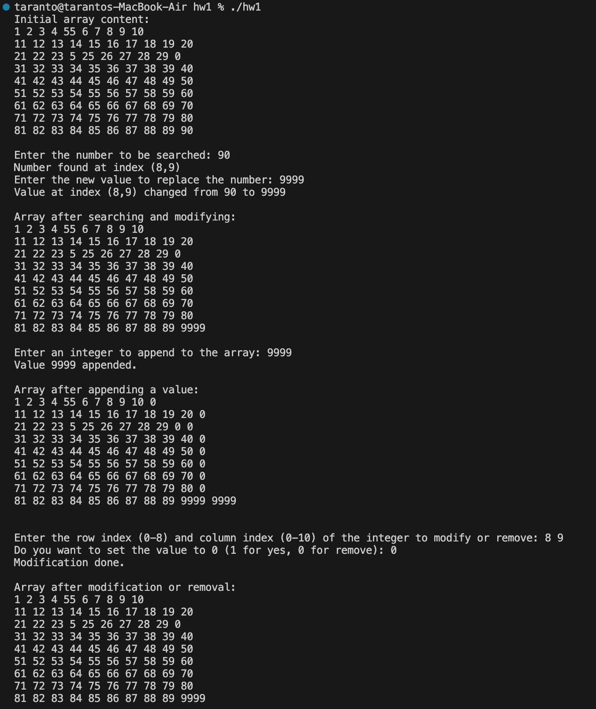
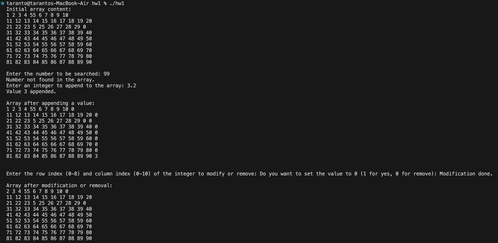

# Author: Jordan Taranto
### Date: 08/31/2023
### UMKC CS303
### Assignment: 1

--- 

### Screenshot of four basic functions:

### Error Handling:

Makes sure that the user enters a valid index, and that the file exists.
