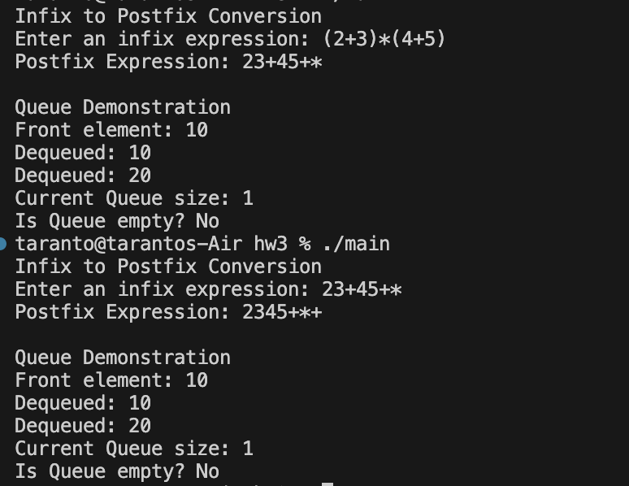

# Author: Jordan Taranto

### Compile and run
```g++ -std=c++11 -o main main.cpp ExpressionManager.cpp```
```./main```

### Main

Inside of main it walks you through how to do each task specified inside of the homework 


# OUTPUT
